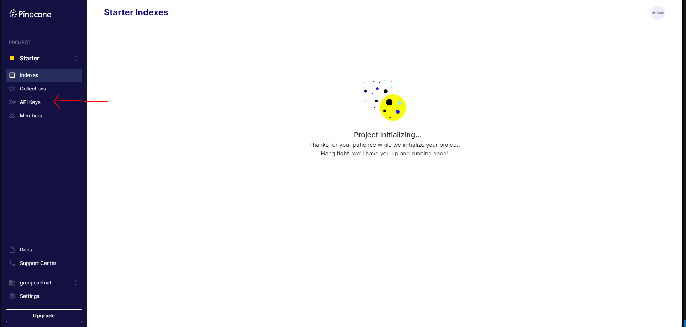
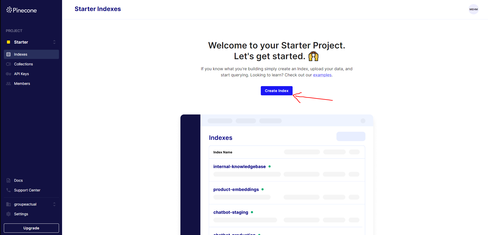
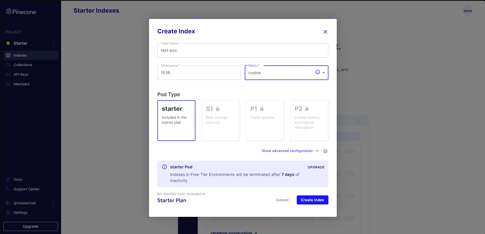
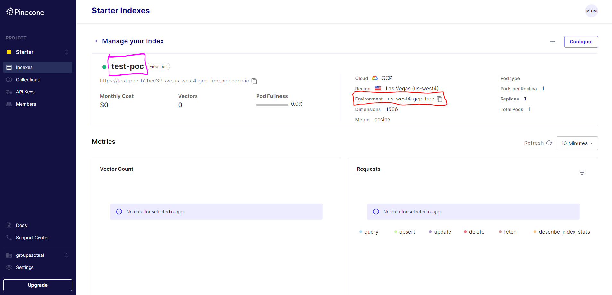

1. `npm i`
2. Placer des fichiers pdf dans le dossier `docs`
3. Lancez `cp .env.example .env` et remplissez les champs 
-   OPENAI_API_KEY : votre clé API OpenAI
-   PINECONE_API_KEY : votre clé API Pinecone, pour ça il faut créer un compte sur [Pinecone](https://www.pinecone.io/)
     

    

     
-   PINECONE_ENVIRONMENT et PINECONE_INDEX_NAME: vous devez créer un index sur Pinecone, pour ça il faut créer un environnement et un index
    
    

     

    -   Il faut ensuite remplir les champs comme dans l'image ci-dessous et cliquer sur "Create Index"
    -   Le nom de l'index c'est a vous de le choisir
    -   La dimension doit être de 1536 comme dans l'image

     

    

-   Le PINECONE_ENVIRONMENT c'cest la partie rouge dans l'image ci-dessous, et le PINECONE_INDEX_NAME c'est la partie violet

     

    

4. Lancez `npm run ingest` pour envoyer les fichiers pdf dans Pinecone (base de données, ça peut prendre un peu de temps a embed les fichiers)
5. Lancez `npm run dev` pour lancer le serveur
6. Commencez a poser des questions sur `http://localhost:3000`
